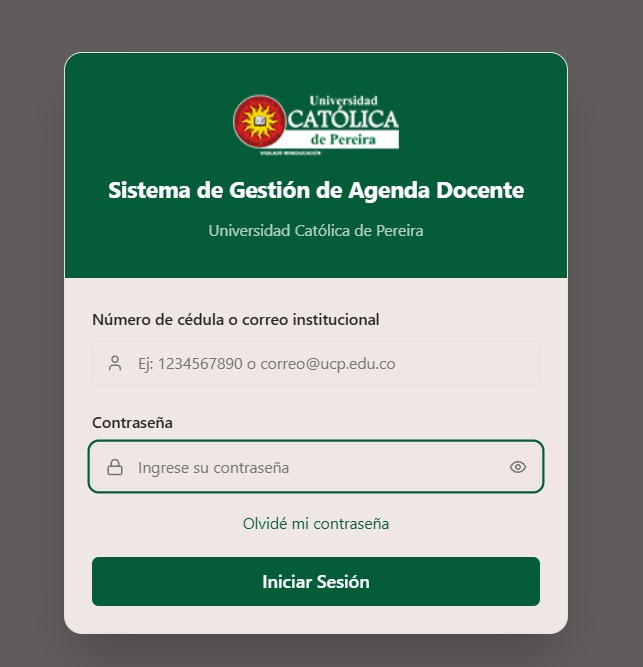
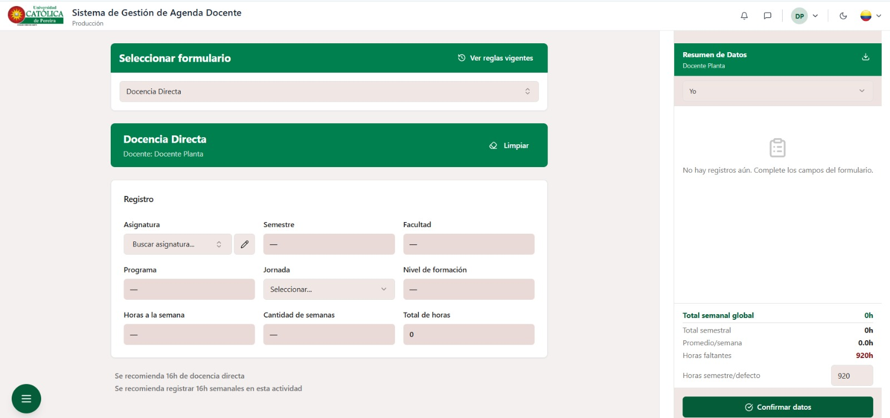
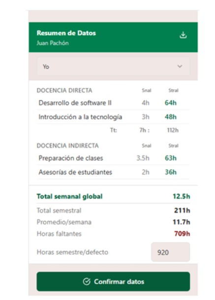
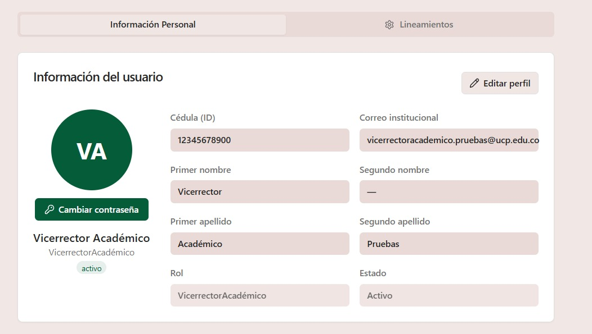
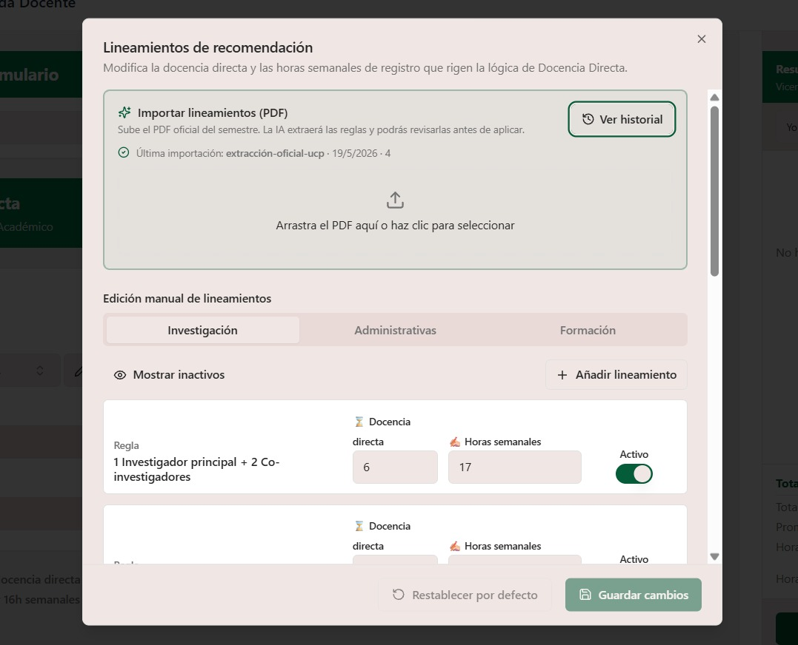

# Sistema de Agenda Docente — UCP

Aplicación web para la gestión de agendas y distribución horaria de docentes de planta de la Universidad Católica de Pereira.

El sistema permite registrar, gestionar, revisar y aprobar las agendas docentes, centralizando el proceso y facilitando el seguimiento de las actividades y horas asignadas.

> Este repositorio contiene el **frontend** de la aplicación.
> El backend desarrollado con Express + PostgreSQL se encuentra en un repositorio independiente: **`agenda-ucp-backend`**.

## Funcionalidades principales

- Autenticación y gestión de usuarios.
- Gestión de agendas docentes.
- Registro y distribución de actividades y horas.
- Consulta y seguimiento de agendas.
- Flujo de revisión y aprobación.
- Gestión de comentarios y observaciones.
- Visualización de información según el rol del usuario.
- Registro de actividades y trazabilidad.
- Generación de reportes.
- Gestión de configuraciones y lineamientos.
- Integración con servicios de inteligencia artificial para el procesamiento de documentos PDF y extracción de lineamientos.

## Capturas del sistema

### Inicio de sesión

Pantalla de acceso al Sistema de Gestión de Agenda Docente.



### Gestión de agenda

Pantalla principal para la selección del formulario y el registro de las actividades docentes.



### Resumen de datos

Panel de resumen de la distribución horaria y las horas registradas en la agenda.



### Perfil del usuario

Información del usuario, rol y configuración del perfil dentro del sistema.



### Gestión de lineamientos con IA

Módulo para importar documentos PDF de lineamientos institucionales. El sistema utiliza inteligencia artificial para extraer las reglas del documento y permite revisarlas y modificarlas antes de aplicarlas.



## Stack tecnológico

### Frontend

- React 18
- Vite 5
- TypeScript 5
- Tailwind CSS v3
- shadcn/ui
- React Router
- React Query

### Backend

- Node.js
- Express
- TypeScript
- PostgreSQL

### Infraestructura

- Docker
- Docker Compose
- Render

### Inteligencia artificial

- Google Gemini API

### Control de versiones

- Git
- GitHub

## Arquitectura

La aplicación utiliza una arquitectura separada de frontend y backend.

El frontend desarrollado con React se comunica con el backend mediante una API REST. El backend implementa la lógica de negocio y gestiona la persistencia de información en PostgreSQL.

```text
                    ┌─────────────────────┐
                    │       Usuario       │
                    └──────────┬──────────┘
                               │
                               ▼
                    ┌─────────────────────┐
                    │      Frontend       │
                    │ React + TypeScript  │
                    │       + Vite        │
                    └──────────┬──────────┘
                               │
                            API REST
                               │
                               ▼
                    ┌─────────────────────┐
                    │       Backend       │
                    │ Node.js + Express   │
                    │     + TypeScript    │
                    └──────────┬──────────┘
                               │
                               ▼
                    ┌─────────────────────┐
                    │     PostgreSQL      │
                    └─────────────────────┘
